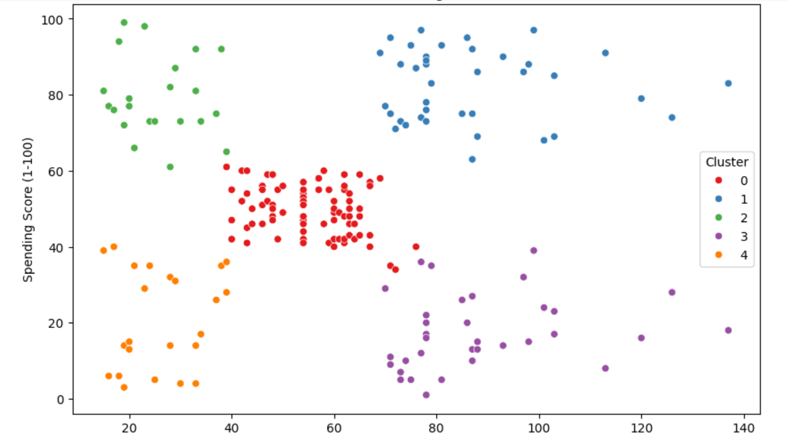
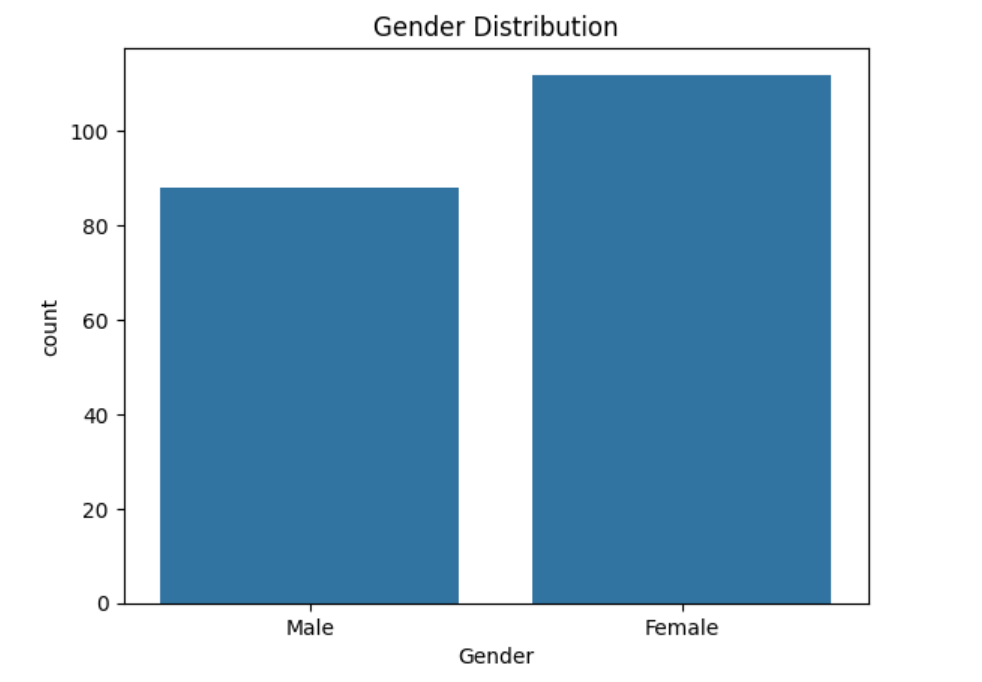
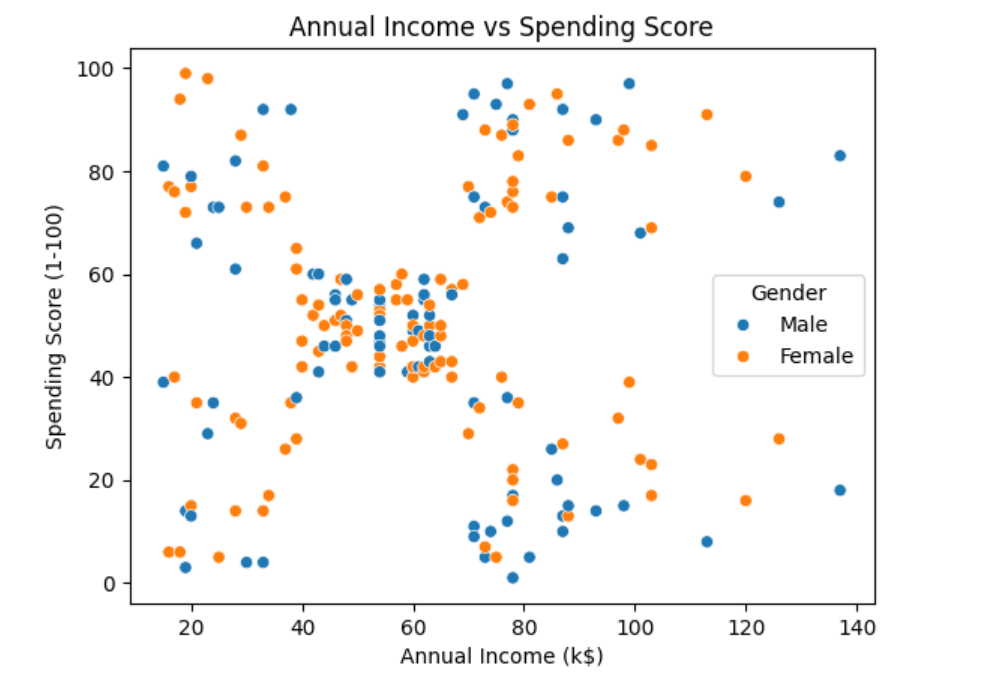

# Mall-Customer-Segmentation
Mall customer segmentation using K-Means clustering with EDA and business insights.

# 🛍️ Mall Customer Segmentation

Segment mall customers into meaningful groups using unsupervised learning (K-Means clustering) to help businesses understand customer behavior and make data-driven marketing decisions.

---

## 📌 Project Objective

To analyze customer behavior based on features like age, annual income, and spending score, and group them into distinct segments using clustering techniques.

---

## 📊 Dataset

- **Source**: [Kaggle - Mall Customers](https://www.kaggle.com/vjchoudhary7/customer-segmentation-tutorial)
- **File**: `Mall_Customers.csv`
- **Features**:
  - CustomerID
  - Gender
  - Age
  - Annual Income (k$)
  - Spending Score (1–100)

---

## 🧠 Techniques Used

- Exploratory Data Analysis (EDA)
- Data Visualization (Seaborn, Matplotlib)
- K-Means Clustering
- Elbow Method for optimal clusters
- Insight extraction for business use cases

---

## 🧩 Key Insights

| Segment | Income | Spending | Notes |
|--------|--------|----------|-------|
| Cluster 0 | High | Low | Value shoppers, spend less despite income |
| Cluster 1 | Low | High | Impulsive buyers, low income |
| Cluster 2 | Medium | Medium | Average, balanced customers |
| Cluster 3 | High | High | Premium customers, best for upselling |
| Cluster 4 | Low | Low | Budget-conscious, low ROI segment |

---

## 📸 Visuals

| Visualization | Description |
|---------------|-------------|
|  | Final clusters on Income vs Spending |
|  | Gender distribution |
|  | Relationship between income and spending |

---

## 🧪 How to Run

1. Clone the repo:
```bash
git clone https://github.com/yourusername/mall-customer-segmentation.git
cd mall-customer-segmentation
```
2. Install dependencies:
```bash
pip install -r requirements.txt
```
3. Launch Jupyter Notebook and run:
```bash
jupyter notebook notebooks/Mall_Customer_Segmentation.ipynb
```
